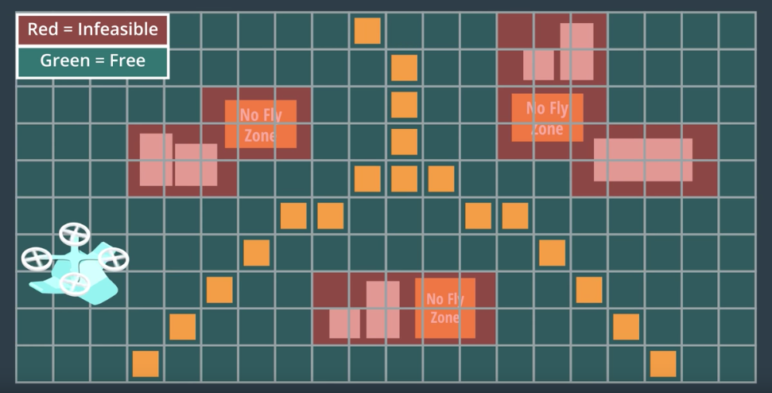

# AAE_Notebook_010_VoronoiGraphs
This notebook is an implementation of a graph-based Voronoi Diagram.

When working with grids, we've had to do a decent bit in order create the grid and come to a reduced number of waypoints for our path. In this notebook, we're going to explore how a grid may (or may not) be a better solution by looking at Voronoi Diagrams (graphs) and Medial Axis Transforms (Grids).

With a graph, we no longer have to traverse from grid cell to grid cell; rather, we can traverse from graph node to graph node.

As with grids, our approach to planning via graphs is as follows:
  1. Define our state-space.
  2. Define a set of actions to move through the state-space.
  3. Define a cost function to capture the cost of each action.
  4. Define a start and goal state.
  5. Implement a search of the sequence of actions that will bring us from our start state to our goal state.

When defining our state-space, we must consider that the environment, itself, may lend to our graph. In example, in a cityscape, the roads and intersections may already define nodes and edges for our graph.

One of the most well known methods for extracting a graph is what's known as a [Voronoi Diagram](https://en.wikipedia.org/wiki/Voronoi_diagram). In it's most basic state, the Voronoi Diagram is a graph that breaks up a map into regions around a set of seed points so that all the point in a given region are closer to the same seed point than any other seed point. (We can, in this application, think of our seed points as our obstacles.)

As you can note from the picture, the edges created in a Voronoi Diagram are equidistant from the seed points (obstacles); thus, we can use the edges as our path without much worry about collision due to the distance buffers created.

However, one of the challenges of using Voronoi Diagrams is that, in the real world, we don't have point obstacles; so, the exact construction of a Voronoi Graph around obstacles is non-trivial. 

Following along the same idea as the Voronoi Diagram, we can consider the Medial Axis method, which uses the same intuition but is easier to compute.

As you notice, the ending iteration of the medial axis transform is quite similar to the Voronoi Diagram; however, we've discretized our environment via a grid-based approach so as to better be able to deal with obstacles.

Let us, now, look at the implementation of the graph-based Voronoi Diagram approach.
